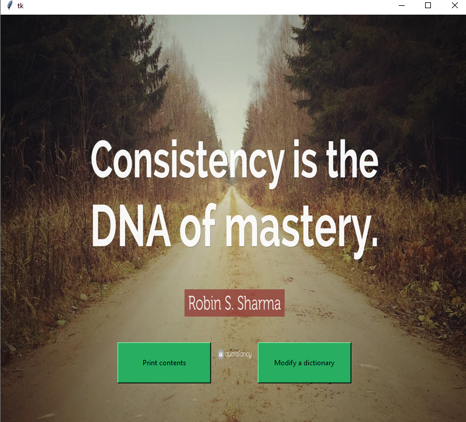
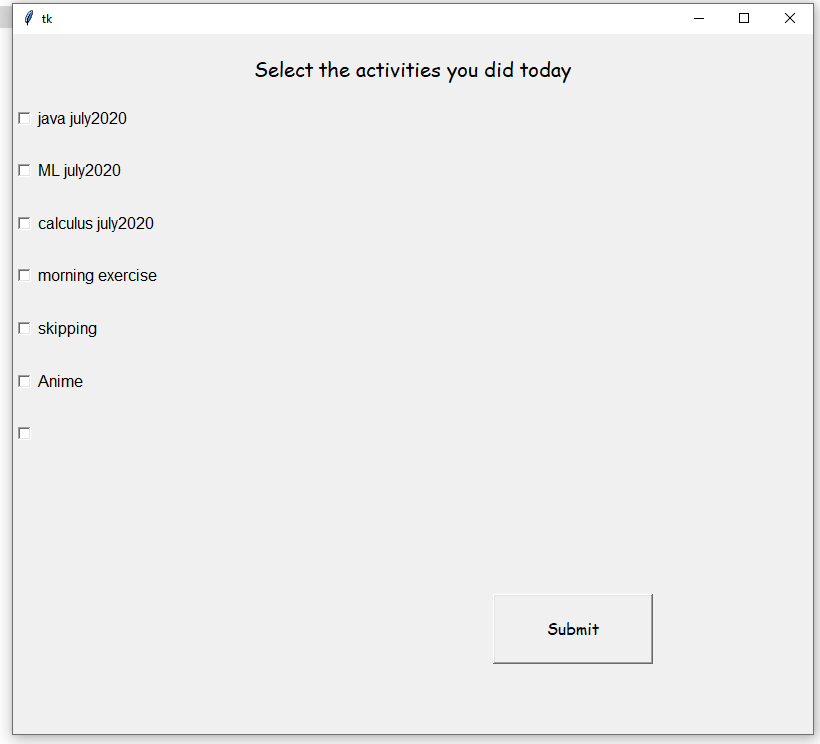

# Consistency

This application has been made to measure and give you feedbacks on your consistency.
Consistency is at the root of mastery.
The application stores data about three types of activities namely PAST, PRESENT, FUTURE(also called dictionaries here).
Future - here you can store the activities you want to undertake in the future.You can store the name and time when you want to do it.
Present - this has to be maintained dynamically.you need to update this everyday and select the activities and goals set.
Past - this stores the activities or goals you have succesfully or unsuccessfully completed.It also stores the final consistency level.

NOTE : the present has to be updated everyday after the completion of the activity.
it stores data in a spreadsheet which can be easily opened on your computer.
the consistency field is a measure of how consistently you do a task on a 10 day basis.That is out of 10 days on average how regularly you complete your daily goals.

The application provides you a Graphical User Interface to easily and quickly modify, maintain and measure your consistency levels.

FIRST DISPLAY:

UPDATE DISPLAY:

